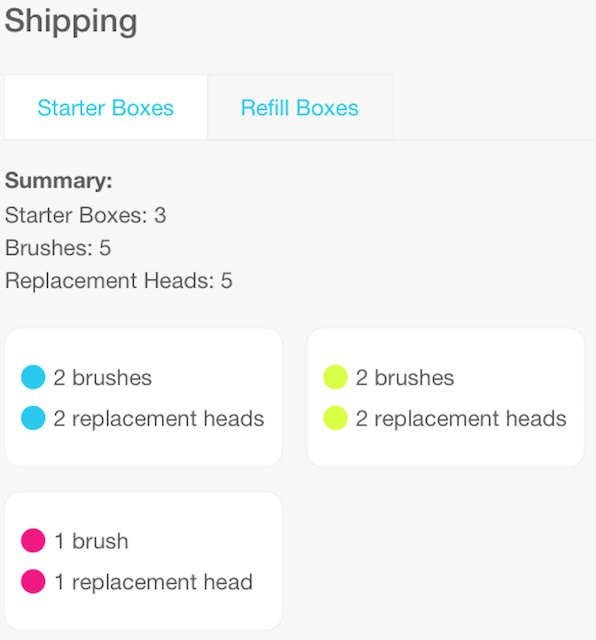
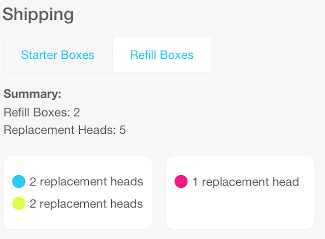

The Javascript Boxing kata
=================

Everyone who has dental insurance through Beam receives perks in the form of electric toothbrushes, replacement brush heads, and paste kits (toothpaste and floss). Each family member gets to choose a toothbrush color at enrollment, and will receive replacement toothbrush heads of the same color.

This kata involves building the brains of a boxing system which will determine how the perks are boxed up and shipped. Given a family's brush color preferences, the system will generate a description of how the boxes should be filled. A shipping manager must be able to load data for a family, create starter and refill boxes. The focus of this kata should be building a website to handle perks.

Instructions
------------
Please read through the user stories below and implement the functionality to complete them according to their requirements. There are lo-fi wireframes attached to give guidance for the UI.  The code design is entirely up to you as long as the solution can be run via npm or yarn (see [Additional sections to include](#additional-sections-to-include)). We also ask that you commit your work to git frequently as you go.

### Evaluation criteria
As there are often trade-offs when crafting a solution, the following is the priority of what we are considering when reviewing your kata:

- **Functionality:** The solution should fulfill the requirements and work correctly. Please feel free to reach out if you have questions about the provided user stories.
- **Testing:** Beam firmly believes in testing as a practice and as such we ask that you add tests. While the choice of testing tools is left up to you, we prefer to see code that has good test coverage.
- **Structure:** Well-factored code is easier to reason about and maintain. We prefer to see good separation of concerns in the architecture.
- **Idiomatic code:** Along similar lines, code that adopts the best practices, idiom and conventions of the language/framework helps with readability and maintainability.
- **Style:** While we are not expecting a pixel perfect implementation, the solution should adhere to the overall wireframes. And please keep in mind that CSS is code too!

### Additional sections to include
These sections will help us understand your thought process and workflow while we review your solution. Feel free to add these sections to this README or in a separate file. 

- **Technical decision making:** Please add a section explaining the technical decision making involved in designing your solution. What options were you considering at various levels (eg. tech stack choice, libraries, and design, as applicable) and what were the trade-offs in choosing one option over another?
- **Instructions on running your code:** As you decide on the tools to build the solution, please add a section letting us know how to run your code and tests.

Submitting your work to Beam
----------------------------
Please include a .nvmrc file with your submission so we know version of node you are using. There are differences between versions that can be significant to your application's runtime versus your reviewer's installed node version.

Once you're happy with your submission ([evaluation criteria](#evaluation-criteria), [additional sections](#additional-sections-to-include)), you can send it back in one of two formats; either as a git bundle or a zip file.

To create the git bundle simply execute:
```
cd boxing-kata-js
git bundle create boxing-kata-js.bundle <YOUR BRANCH NAME HERE>
```

This will create a .bundle file which contains the entire git repository in binary form, so you can easily send it as an attachment. Alternatively, you could zip the project instead.

To ensure that our review of your kata remains as unbiased as possible, your submission will be anonymized before it is reviewed. To help us with this process, **please double check that any personally identifiable information, such as your name or email address, is removed from your code, readme or any commit messages**. Your author and committer information will be scrubbed by our anonymizing process.

High Level Scope
--------------------
At a high level, this kata should accomplish the following:
* Shipping screen that will show the starter boxes and refill boxes for the family

Example JSON File
------------------
The JSON endpoint (https://beamtech.github.io/boxing-kata-js/perks.json) will return the following data shape:


```
[
 {
   "id": 2,
   "name": "Anakin",
   "brush_color": "blue",
   "primary_insured_id": null,
   "contract_effective_date": "2018-01-01"
 },
 {
   "id": 3,
   "name": "Padme",
   "brush_color": "pink",
   "primary_insured_id": 2,
   "contract_effective_date": ""
 },
 {
   "id": 4,
   "name": "Luke",
   "brush_color": "blue",
   "primary_insured_id": 2,
   "contract_effective_date": ""
 },
 {
   "id": 5,
   "name": "Leia",
   "brush_color": "green",
   "primary_insured_id": 2,
   "contract_effective_date": ""
 },
 {
   "id": 6,
   "name": "Ben",
   "brush_color": "green",
   "primary_insured_id": 2,
   "contract_effective_date": ""
 }
]
```

Currently, we only support one family per call.

User Stories
--------------
**Shipping Screen**

_As a Beam Shipping Manager_<br>
_In order to see items that need to ship_<br>
_I want to view a shipping screen with a starter box summary_<br>

The Shipping screen has two tabs on it: one for generating and displaying starter boxes and one for generating and displaying refill boxes.<br>

The user can toggle between starter and refill boxes.  Upon entering the shipping screen, the starter box summary should be displayed.

***Scope***
* Retrieve information from the endpoint listed above
* If the endpoint call fails, display an error message of "Error:  Could not receive family preferences" on the screen.
* Display the Starter Box summary information
* Appropriately enable/disable Starter and Refill Box buttons
* Color Hex Values:
  * Blue: #01c4e9
  * Pink: #e92fac
  * Green: #e0e900

**Starter boxes**

_As a Beam Shipping Manager_<br>
_In order to ship perks_<br>
_I want to fill starter boxes_<br>

Now that member data has been fetched, the shipping manager can begin filling boxes.  Each family member will receive one brush and one replacement head. Both the brush and the replacement head must be in the family member's preferred color. A starter box can contain a maximum of 2 brushes and 2 replacement heads in any combination of colors.  Group colors in a box, when possible. 

For example, if you have 2 blue brushes and 1 pink brush, you should end up with:

- A box with 2 blue brushes and 2 blue replacement heads
- A box with 1 pink brush and 1 pink replacement head

You should not end up with:

- A box with 1 blue brush, 1 pink replacement head, 1 blue replacement head, 1 pink replacement head
- A box with 1 blue brush, 1 blue replacement head.

When the shipping manager presses the shipping button, then I will navigate to the Starter Boxes screen with each starter box displayed with a summary line.  Using the brush preferences example above, box output will be generated in the following format:




**Acceptance Criteria**

* Display starter boxes based on family preferences
* Group colors in a box when possible 

<br>

**Refill Boxes**

_As a Beam Shipping Manager_<br>
_In order to ship perks_<br>
_I want to fill refill boxes_<br>

A family should receive refill boxes with a replacement brush head in each member's preferred color. A refill box can contain a maximum of 4 replacement heads. Group colors in a box, when possible (consider the same example as above). When the shipping manager presses the refill boxes button, then a number of refill boxes are output. Using the brush preferences example above, box output will be generated in the following format:



**Acceptance Criteria**

* Display refill boxes based on family preferences
* Refill box can contain a maximum of 4 replacement heads
* Group colors in a box, when possible

# beam-dental-javascript
